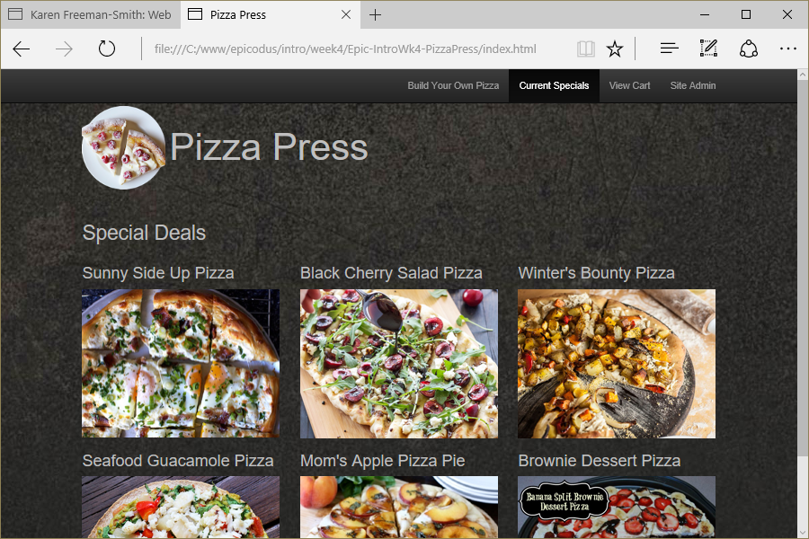

# Pizza Press
Version 0.0.1: August 28, 2016
by [Karen Freeman-Smith](https://karenfreemansmith.github.io)

### Technologies Used
HTML, CSS, Bootstrap, JavaScript, jQuery

## Description
*[Epicodus](http://epicodus.com) Intro to Programming Week 4 Final Individual Project: A web-based pizza order form with an admin area where you can set up your pizzas in local storage.*

## Setup/Installation
* [View on Github Pages](https://karenfreemansmith.github.io/Epic-IntroWk4-PizzaPress)
* _OR_
* Clone directory
* Open index.html in your favorite browser

## Support & Contact
For questions, concerns, or suggestions please email karenfreemansmith@gmail.com

## Specifications
* Allow the user to choose toppings and size for the pizza they'd like to order.
* Create a pizza object constructor with properties for toppings and size.
* Create a prototype method for the cost of a pizza depending on the selections chosen.
Additional features:
* Admin page to add toppings and size options with prices.
* Keep settings saved in local storage.

## Known Issues
* Several admin features are still unfinished

## Legal
*Licensed under the GNU General Public License v3.0*

Copyright (c) 2016 Copyright _[Karen Freeman-Smith](https://karenfreemansmith.github.io)_ All Rights Reserved.
